# UI/UX Documentation

## Figma Link
[Access the Figma Project Here](https://www.figma.com/design/xuM2J5JGZrJHiqXvFWowJ5/Joynride-Figma?node-id=0-1&t=PWLsqxXulxxdUOLR-1)

---

## Overview
This document describes the UI/UX design decisions made for the project, including logo design, overall design style, color scheme, and detailed descriptions of the created screens. 

---

## Logo Design
- **Concept**: Describe the concept and thought process behind the logo (e.g., minimalist, symbolic, etc.).
- **Style**: Mention the design style used for the logo (e.g., flat, gradient, modern, etc.).
- **Significance**: Explain the significance of the logo elements (e.g., shapes, colors, typography).

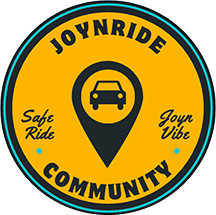

---

## Design Style
- **Overall Theme**: We followed Google's Material Design 3 language, trying to create a modern and clean looking interface.
- **Typography**: We used Roboto as our main font because it matches quite well with Material Design 3.
- **Icons**: We also kept in line with our chosen design language and went for the icons provided by Google.

---

## Color Scheme

For the color palette selection, the colors used in the University of São Paulo's system were taken as a reference, namely Blue (Hex: 087F96), which was used as the predominant color of the application, and yellow (Hex: E28B00), used for highlights.  

After defining the two main colors, the website [https://uicolors.app/create](https://uicolors.app/create) was used to generate a complementary color palette based on the chosen colors.

**Primary Colors**
The primary color category includes blue tones divided into different levels for usage. Each level corresponds to a shade of blue, numbered for clarity (e.g., Primary/100 to Primary/1100).

Primary/100: #ebfffe

Primary/200: #cdffff

Primary/300: #a1fbff

Primary/400: #60f6ff

Primary/500: #18e6f8

Primary/600: #00c9de

Primary/700: #0094ac

Primary/800: #087f96

Primary/900: #10667a

Primary/1000: #125567

Primary/1100: #053847

The Primary color scheme, ranging from light to dark blue, is suitable for key UI components like buttons, links, and primary highlights.

**Secondary Colors**

- **Contrast and Accessibility**: Explain how color choices address accessibility concerns (e.g., WCAG compliance).

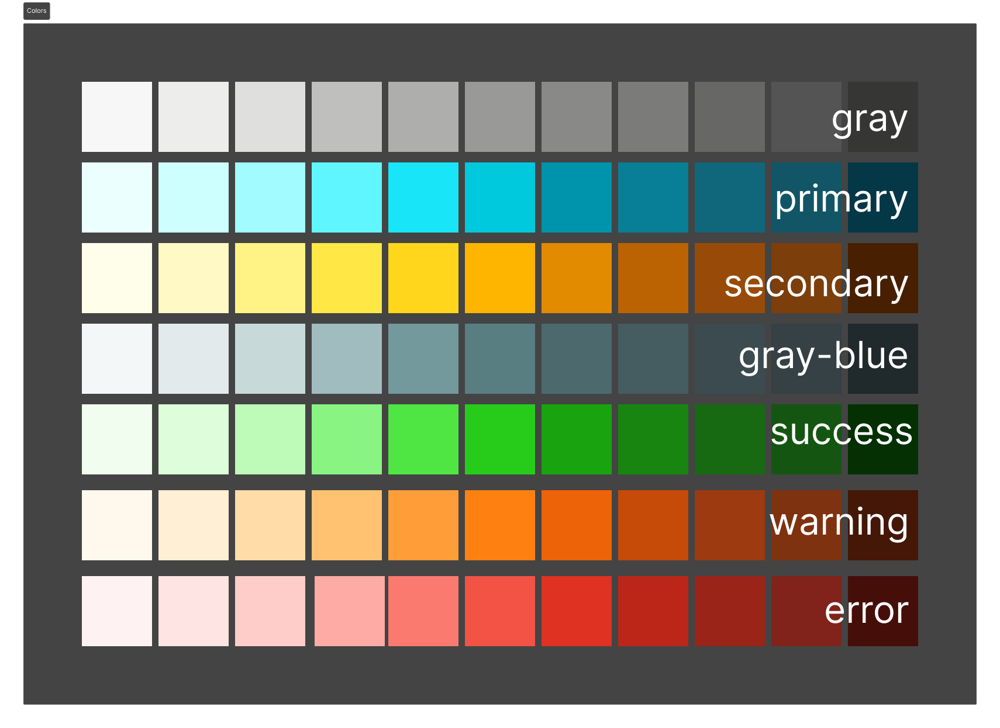

---

## Screens Overview
This section provides an overview of each screen, its purpose, and the key design decisions.

### Flash Screen
- **Purpose**: Opens with the application and stays on screen while everything loads.
- **Design Decisions**: We decided to keep it as simple as possible with only our logo in the middle with a clean background with our primary color

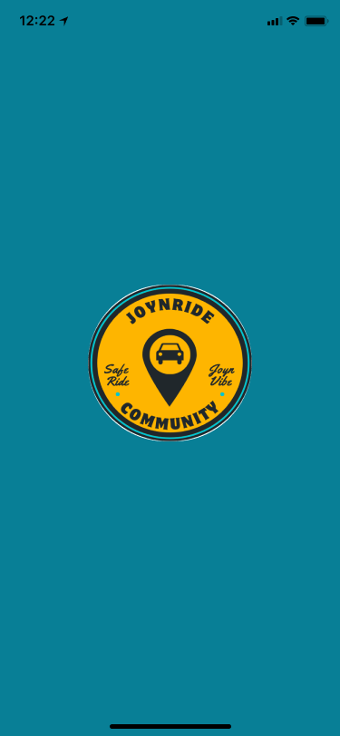

### Login
- **Purpose**: Allow the user to access it's own account with JupiterWeb unified login system
- **Design Decisions**: We kept it simple with a logo, a title and a button that will redirect the user to the unified login page.

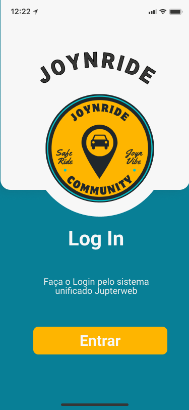

### Navigation bar
- **Purpose**: Provide easy access to different sections of the app.
- **Design Decisions**: We gave the user access to the five main sections of the app: search, offer, rides, messages and profile.

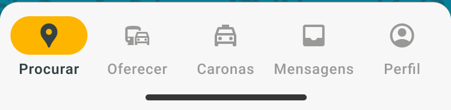

### Search
- **Purpose**: Allow the user to search for rides.
- **Design Decisions**: We were heavily inspired by Blablacar design, trying to keep it as simple as possible. The user can search for rides by typing the origin, destination, date of the ride and the number of passengers.

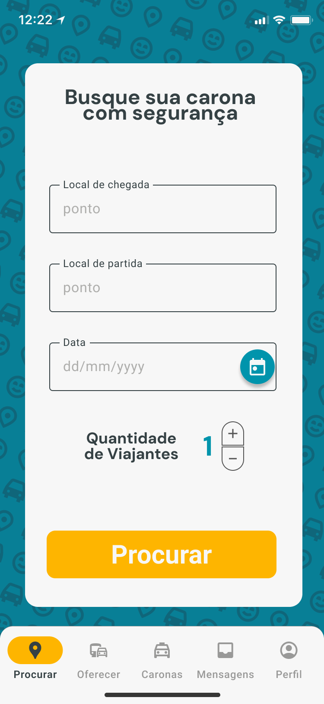

### Available rides
- **Purpose**: After searching, display available trips for users.
- **Design Decisions**: At the top we show the user's search parameters with a button that can display a dialog for filters and below we show the available rides. All the rides have a status symbol that shows how far the ride is from the user's desired location (green for near, orange for walkable and red for far).

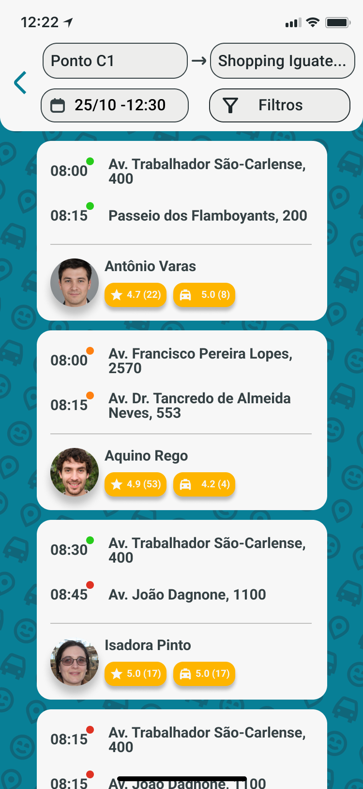

### Unreserved selected ride
- **Purpose**: Showcase details of a trip before reservation.
- **Design Decisions**: We give the user all the relevant information about the ride: date, time and location of departure and arrival with our distance status, the driver's name, ratings and option to message, the car's model and color, the number of passengers and a button to reserve the ride.

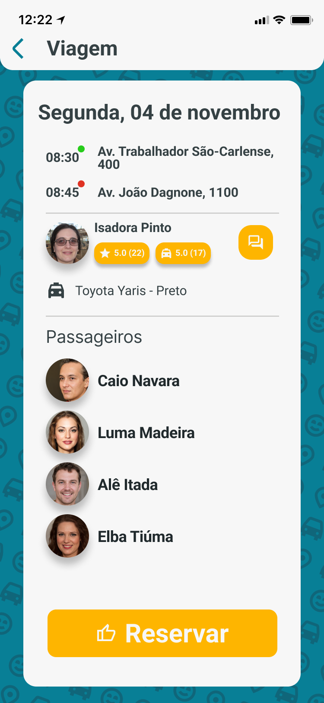

### Alert Dialogue
- **Purpose**: Warn users about critical actions.
- **Design Decisions**: We kept this as simple as possible with a title, a green button to confirm and a red button to cancel.

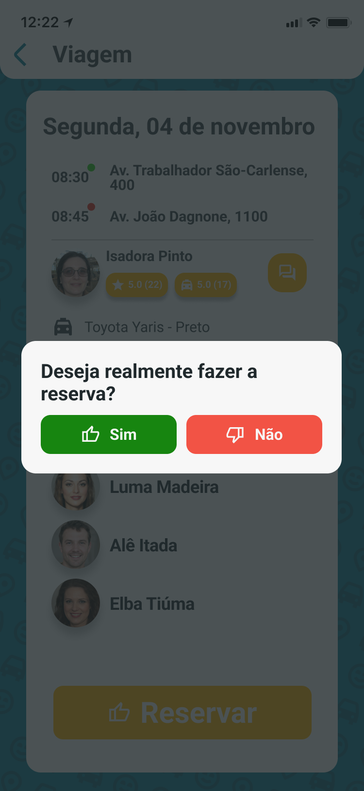

### Offer
- **Purpose**: Allow users to offer a ride.
- **Design Decisions**: Also heavily inspired by Blablacar. The user types the origin, destination, date and time of the ride, number of passengers and if it's a fast reservation or not.

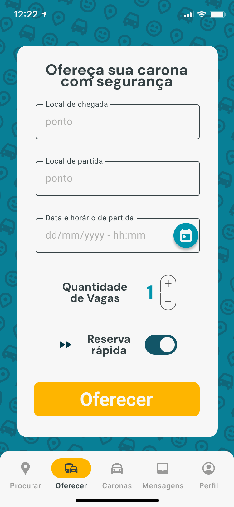

### Offered ride
- **Purpose**: About the same purpose as the "Unreserved selected ride" screen, but for the driver.
- **Design Decisions**: We kept the same layout as the "Unreserved selected ride" screen, but with a few differences: we don't show the distance status, we can accept or refuse a rider and the option to cancel the ride.

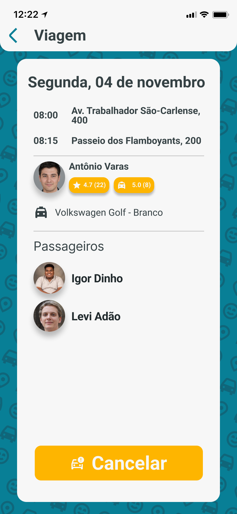

### My rides
- **Purpose**: Display trips that the user is associated with.
- **Design Decisions**: Mention list design, visual prioritization of reserved trips, etc.

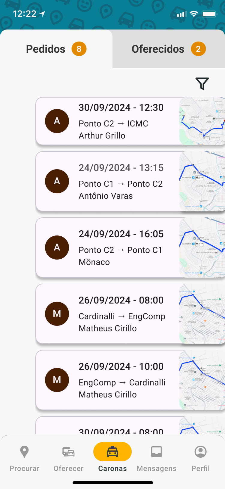

### Reserved rides
- **Purpose**: Show the details of a reserved trip.
- **Design Decisions**: Explain the layout for presenting reserved trip information.

### Messages
- **Purpose**: Display a list of conversations.
- **Design Decisions**: Mention style for message preview cards and notification indicators.

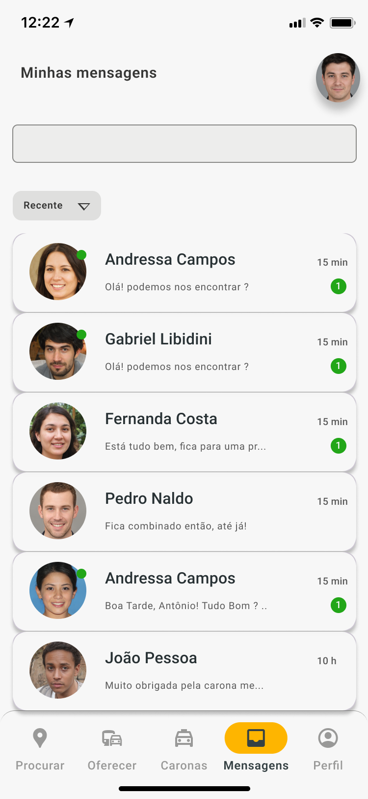

### Dialogues
- **Purpose**: Enable direct communication between users.
- **Design Decisions**: Explain the chat layout, text input area design, and message bubble style.

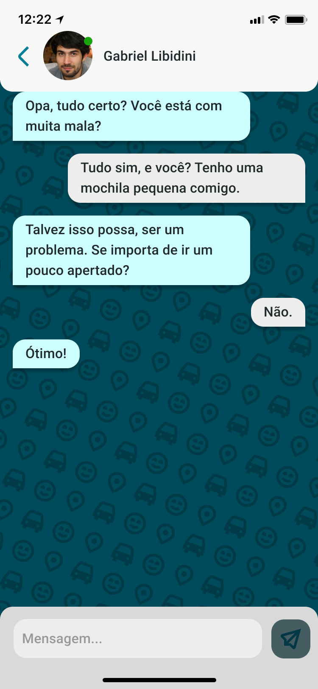

### My profile
- **Purpose**: Present the user's profile details.
- **Design Decisions**: Describe the layout and emphasis on editable fields.

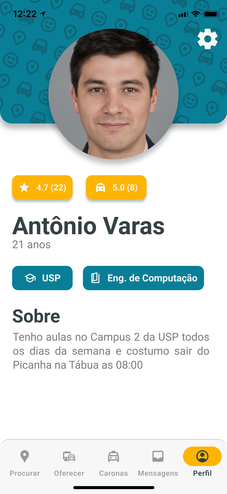

### Other user's profile
- **Purpose**: Display another user's profile information.
- **Design Decisions**: Highlight differences from the user’s profile view.

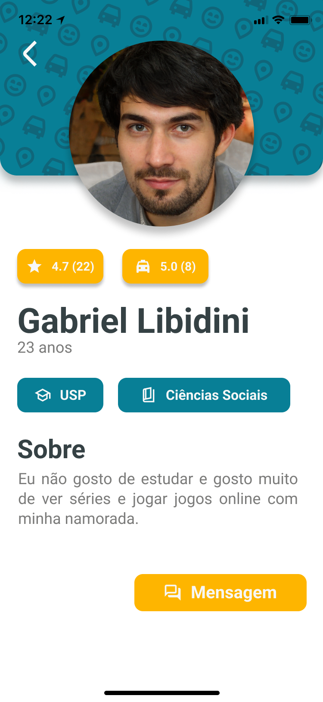

---

## Key Design Decisions
- **Consistency**: Detail how consistency across screens was maintained.
- **Accessibility**: Describe accessibility considerations (e.g., font size, color contrast).
- **User Feedback**: Mention how user feedback influenced the design.

